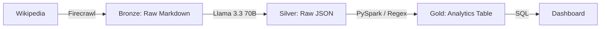

# AI-Startup-Pulse
AI startup tracker

Track AI startups against key metrics - funding, product innovation, and market sentiment

---

# AI Startup Analyzer: End-to-End Medallion Pipeline

An automated data engineering pipeline that tracks the release velocity and product landscape of top AI startups. This project demonstrates a full ** Databricks Medallion Architecture** using modern LLM-based extraction and Spark data processing.

## Architecture Overview

The pipeline is split into three distinct stages to ensure data reliability and quality:

1. **Bronze (Ingestion):** Scrapes raw Wikipedia content using **Firecrawl**. Handles the extraction of "messy" Markdown while filtering out non-essential HTML tags.
2. **Silver (Refinement):** Uses **Meta Llama 3.3 70B** (via Databricks Model Serving) to transform unstructured Markdown into structured JSON. Features a custom system prompt to ignore seasonal noise like Wikipedia's donation banners.
3. **Gold (Analytics):** Parses JSON using **Spark SQL**, enforces schema validation, and flattens nested arrays into an analytics-ready leaderboard.

## Key Technical Challenges Solved

* **Adversarial Noise Filtering:** Implemented advanced regex and prompt engineering to bypass Wikipedia's holiday donation banners, which typically break standard text extractors.
* **Schema Enforcement:** Utilized Spark's `from_json` with `FAILFAST` mode to ensure that inconsistent LLM outputs were caught and handled before reaching the analytics layer.
* **LLM Hallucination Mitigation:** Configured the extraction layer to strictly follow the Infobox data structure of the source text, ensuring high accuracy for founding years and product lists.

## Data Flow

## Getting Started

1. **Prerequisites:** Databricks Workspace, Firecrawl API Key, and access to Databricks Model Serving (Llama 3.3 endpoint).
2. **Installation:**
* Clone this repo into your Databricks Git Folder.
* Run `01_bronze_ingestion` to fetch startup data.
* Run `02_silver_cleaning` to trigger the LLM extraction.
* Run `03_gold_analytics` to generate the final tables.

## Visualizations

The final Gold table powers a **Startup Release Leaderboard** showing:

* Model count per founding year.
* Product distribution by startup.
* Historical release velocity.

* 

---

